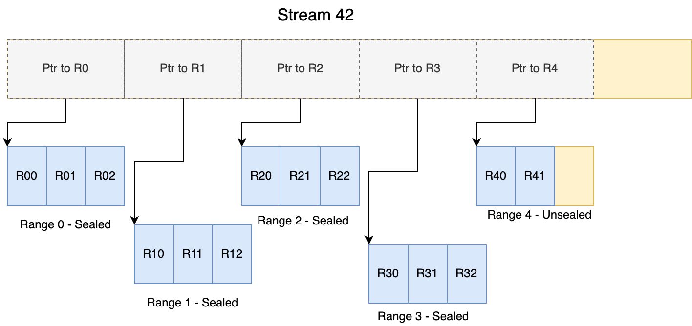
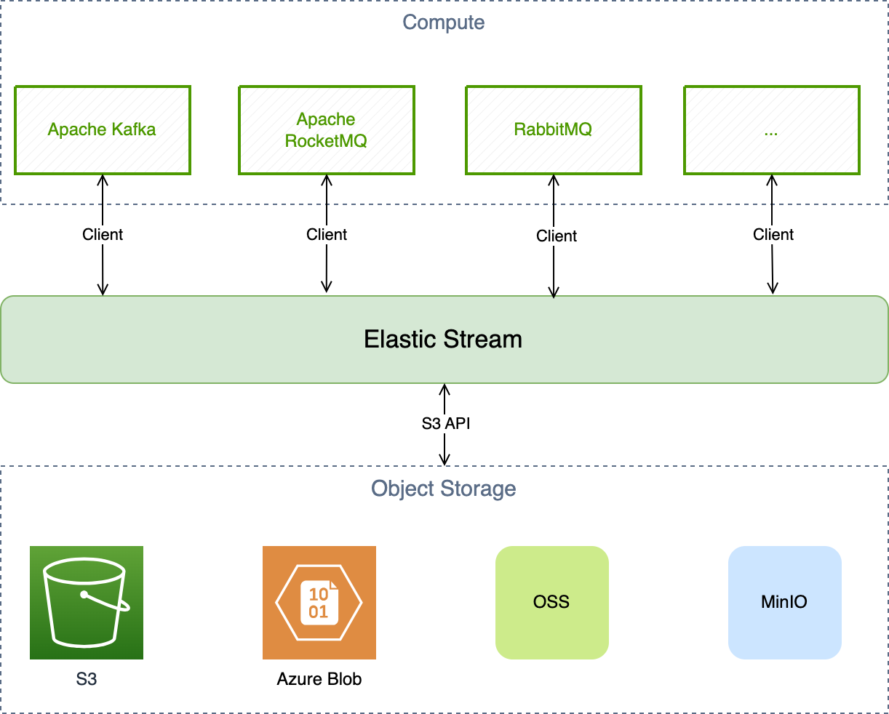

## Concepts

### Record
A record is a piece of information in your business system, representing an event in the domain, or a state change. Typically, a record contains timestamp, metadata headers, system properties and value. A record can be single or composite. A composite record holds multiple internal single ones and there is a system property length for the number of single records inside.

Record is the minimum unit of data for reading and writing in Elastic Stream.

### Range
A range contains an sequence of records. A range is replicated among a set of range servers to be resilient to occasional range server loss. On creation, ranges are mutable and ready to accept appending of records. Once sealed, they become immutable forever.

### Stream
Every stream has an unique ID in the management plane. Conceptually, a stream is an ordered list of pointers to ranges maintained by placement driver servers. Only the last range is mutable and all the prior ones are immutable.

### Placement Driver

Placement Driver(PD, hereafter) tracks ranges for each stream and manages placements for replicas of every range. PD is built on top of RAFT consensus algorithm and is off the critical path of client requests.

### Range Server

## Layers
At the highest level, our architecture is manifested as a number of layers, each of which interacts with the layers directly above and below it as relatively opaque services.

| Layer  | Order  | Goal  |
|---|---|---|
| Compute  | 1  | messaging and streaming semantics, compute scalability |
|  Elastic Stream |  2 | high performance, low latency, fault tolerance  |
|  Object Storage |  3 | Cost effective, unlimited storage capacity |

### Compute Servers
This layer offers messaging and streaming semantics.
1. Kafka
2. RocketMQ
3. RabbitMQ
4. ...

### Elastic Storage Layer
1. Extremely low latency on top of NVMe Storage: P99.9 ~= 1ms
2. Tendency to zero failover
3. Replication:
   (a) 2/3 chasing-write optimizes latency further and offers enterprise data integrity.
   (b) Choices among (1/2, 2/3) chasing-write offers even cheaper option.
4. Provides blazing fast data-read for {hot, warm} data.
5. Fill IOPS gaps between highly-concurrent record publishing and limited object-storage IOPS
6. General-purpose indexing, shared by various compute servers.

### Object Storage Layer
1. TCO reduction: order of magnitude
2. Unlimited Storage Capacity
3. Long term data reliability for the bulk of the system.
